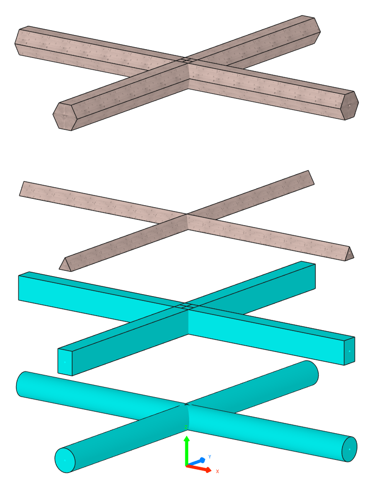

# Beams Showcase

This simple example shows you how to work with beams and programmatically create them using the constructors of the `Beam` class.

```python
--8<--
examples/beams-showcase.py
--8<--
```

If run successfully, you should get the following output in Cadwork 3d:


