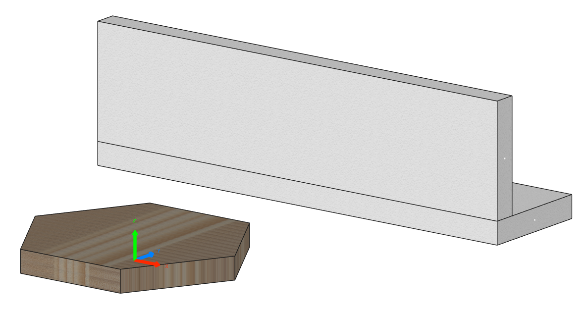

# Panels Showcase

This simple example shows you how to work with panels and programmatically create them using the constructors of the `Panel` class.

```python
--8<--
examples/panels-showcase.py
--8<--
```

If run successfully, you should get the following output in Cadwork 3d:


