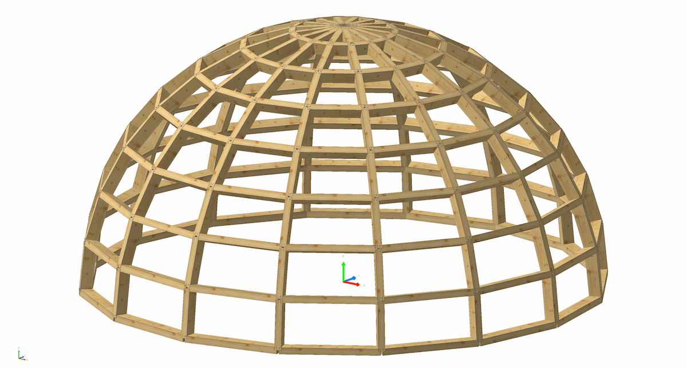

# COMPAS cadwork

COMPAS cadwork is an open-source Python package that brings the COMPAS framework into cadwork 3D.

Make use of COMPAS' extensive geometry kernel, data structures, and algorithms to create, manipulate, and analyze your 3D models in cadwork.
Gain access to the COMPAS ecosystem which includes a wide range of tools and libraries engineered for the AEC industry.
