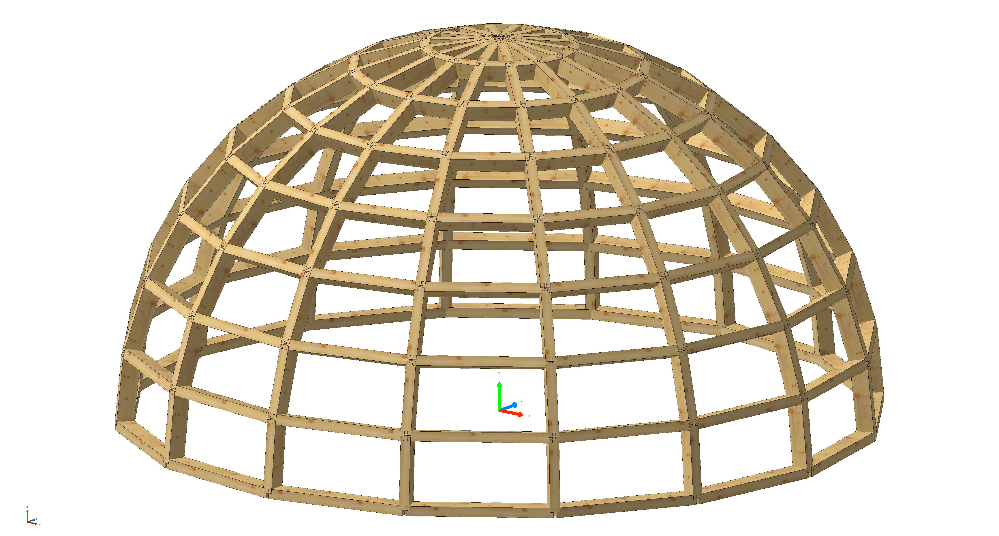

********************************************************************************
COMPAS cadwork
********************************************************************************

.. rst-class:: lead

    COMPAS cadwork is an open-source Python package which allows you to harness the power of the COMPAS framework inside cadwork 3d.

.. rst-class:: lead

    Make use of COMPAS' extensive geometry kernel, data structures, and algorithms to create, manipulate, and analyze your 3d models in cadwork.
    Gain access to the COMPAS ecosystem which includes a wide range of tools and libraries engineered for the AEC industry.

Table of Contents
=================

.. toctree::
   :maxdepth: 2
   :titlesonly:

   Introduction <self>
   installation
   examples
   api
   license

Indices and tables
==================

* :ref:`genindex`
* :ref:`modindex`
