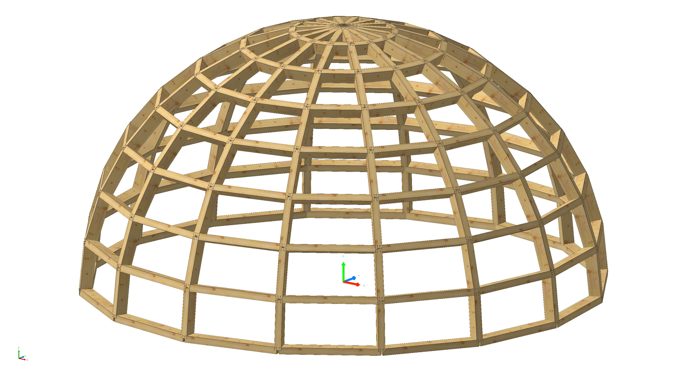

**************
COMPAS cadwork
**************

.. rst-class:: lead

    COMPAS cadwork is an open-source Python package which allows you to harness the power of the COMPAS framework inside cadwork 3d.

Make use of COMPAS' extensive geometry kernel, data structures, and algorithms to create, manipulate, and analyze your 3D models in cadwork.
Gain access to the COMPAS ecosystem which includes a wide range of tools and libraries engineered for the AEC industry.

Table of Contents
=================

.. toctree::
   :maxdepth: 2
   :titlesonly:

   Home <self>
   getting-started/index
   examples/index
   api/index
   license

Indices and Tables
==================

* :ref:`genindex`
* :ref:`search`
