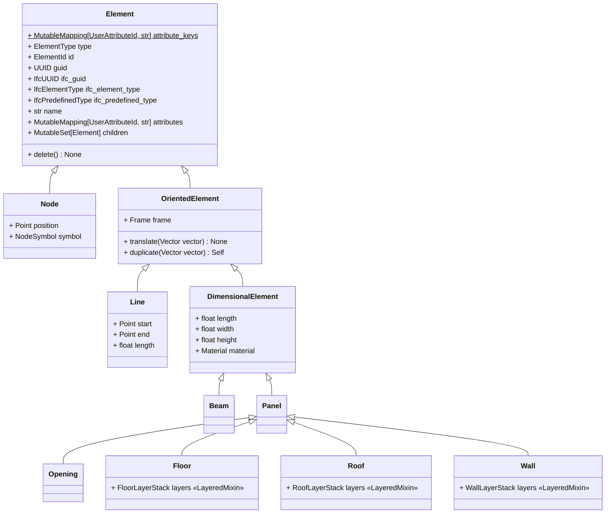

# Elements Hierarchy

In COMPAS cadwork, project elements can belong to different types, such as beams, panels, and walls.
These elements are organized in a hierarchy, and each type exposes its own set of properties and methods.

This means that, while all elements share common behavior, some operations and attributes are specific to a particular element type.
Understanding this hierarchy will help you understand which functionality is available for each kind of element.

The following class diagram summarizes the element classes provided by the library:

